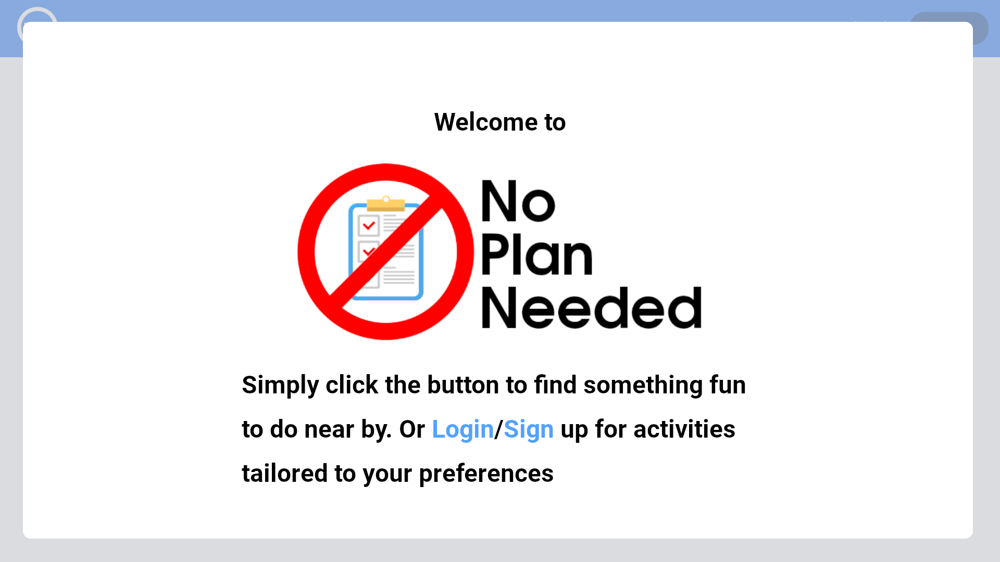
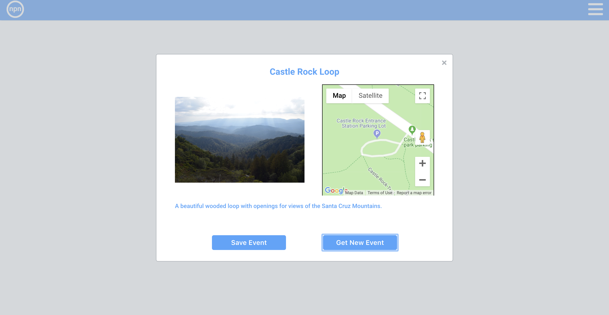
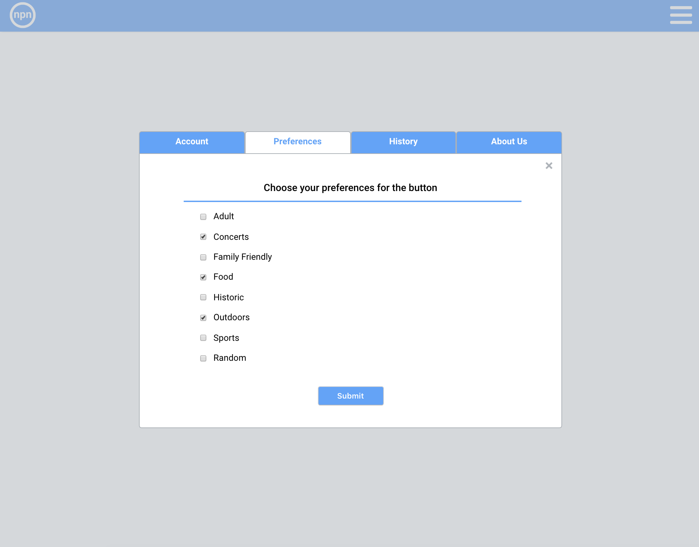

# NoPlanNeeded

NPN is a quick and powerful random event generator. You can check out a [live](https://noplanneeded.herokuapp.com/#/) demo here!




## Table of Content
---
    * [Introduction](#introduction)
    * [Getting Started](#getting-started)
    * [Technical Challenges](#technical-challenges)
    * [Code Snippets](#code-snippets)


## Introduction
---
As individuals living in the modern age, we are enveloped by choice. Too much choice. And finding what to do with our spare time is no exception.

Enter NoPlanNeed; an easy-to-use and effective random event generator that allows users to filter based on their preferences and location to find the next event that is perfect for them and their friends.

Not feeling picky? NoPlanNeeded also has a simple generator feature that requires no login or signup and will provide the user with events filtered by the users current location.




## Getting Started
---
1. You can check out a [live](https://noplanneeded.herokuapp.com/#/) demo here!
2. Create a user, save your preferences, and push the button!

## Features
---
- All users can get a random event in the San Francisco with a picture and location of the event
- Logged-in users can
    - save their preferences for events
    - set their preferences for certain events
    - view their user information
    - view their previous saved events



## Technologies & Challenges
---
No Plan Needed is a web application built using MongoDB, as the database; using express.js, as a framework;and React as the frontend. The database will be used to store user information, preferences, and previous events attended.

### Backend Technical Challenges:
- Events should not be saved into the database unless a user savees the event
- User's preferences for event filtering should be saved in the database

### API Technical Challenges:
- Because events are randomly selected from multiple sources (Google Places, Hiking Project, Eventful, izi Travel Tours), they first have to be normalized before being placed into the application state
- Events should be able to be filtered by a user's selected preferences. These include: restaurants, bars, concerts, sports, outdoors activities, etc.
- When the `random` categories is chosen, the event returned should be random(i.e. After 9/10 button clicks will result in a restaurant)

### Frontend Technical Challenges:
- The app should be functional without having to sign up, but signing up offers a few benefits such as saving preferences and events attended
- The event generator should not take a long time to send API requests, parse events, choose and show one
- The event generator should be able to give a default image if the API does not return an image 
- The event generator should return the location on the map


## Code Snippets 
`hikingNormalize.js`
``` Javascript
const hikingNormalizer = (res) => {
  
  const trails = res.data.trails
  const rand_trail = trails[Math.floor(Math.random() * trails.length)];

  const title = rand_trail.name;
  const location = [rand_trail.latitude, rand_trail.longitude];
  const date = new Date().toDateString();
  const picture = rand_trail.imgMedium;
  const description = rand_trail.summary;

  let normalized_trail = {
    title: title,
    location: location,
    eventDate: date,
    picture: picture,
    description: description
  }

  return normalized_trail;
}

export default hikingNormalizer;
``` 
`event_show.jsx`
``` Javascript
  closeModal(e) {
    const modal = document.getElementById("event-modal");
    const xBtn = document.getElementById("modal-x");
    if (e.target === modal || e.target === xBtn) {
      this.props.history.push("/");
    }
  }

  initGeolocation() {
    if (navigator.geolocation) {
      // Call getCurrentPosition with success and failure callbacks
      navigator.geolocation.getCurrentPosition(
        // On success...
        position => {
          this.setState({
            lat: position.coords.latitude,
            lng: position.coords.longitude
          })
          this.getEvent();
        },
        //On failure...
        () => {
          alert("Could not get current location, using default location instead.");
          this.getEvent();
        }
      );
    } else {
      alert("Your browser does not support geolocation, using default location instead.");
      this.getEvent();
    }
  }

  saveEvent() {
    this.props.createPastEvents(this.props.event)
  }

  getEvent() {
    this.props.fetchEvent({
          location: [this.state.lat, this.state.lng],
          categories: this.state.categories
    }) 
  }
``` 

## This project was compromised of: 
  *  [Clayton Christian](https://www.linkedin.com/in/clayton-christian/)
  *  [Devin Flood](https://www.linkedin.com/in/devin-flood-02032125/)
  *  [Nicholas Ecton](https://www.linkedin.com/in/nicholas-ecton-095423120/)
  *  [Stephanie Hsu](https://www.linkedin.com/in/hsusteph5/)


